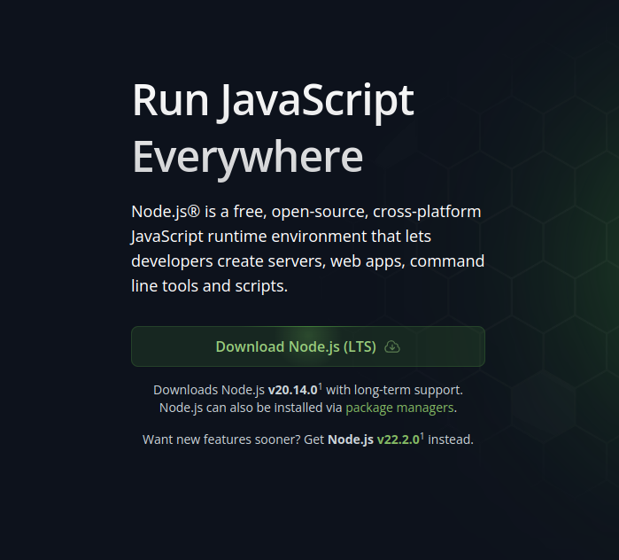

# 1 Node y Entornos de Ejecución

JavaScript es un lenguaje de programación que por defecto solo se puede ejecutar en el navegador web (Chrome, Firefox, Internet Explorer, Microsoft Edge, Brave, Crhomium, ...).

En esta sección nos introduciremos sobre qué es un entorno de ejecución de JavaScript, qué nos posibilita hacer y cuáles son sus características.

## 1.1 ¿Qué es un entorno de ejecución y por qué existen?

Al afrontar el dilema de que JavaScript solo se puede ejecutar en el navegador, diversos desarrolladores nos han traído una solución denominada "entorno de ejecución". Son unos programas que nos permiten la ejecución de código JavaScript fuera del navegador, y así, poder desarrollar aplicaciones desde el lado del servidor, IoT, aplicaciones móviles, aplicaciones de escritorio y más.

Los entornos de ejecución de JavaScript más populares a día de hoy son:
- [Node.js](#12-node)
- [Deno](#13-deno)
- [Bun](#14-bun)

# 1.2 Node

[Node.js](https://nodejs.org/en/) es el entorno de ejecución más popular a día de hoy, siendo altamente demandado en diversos ámbitos. Principalmente en el desarrollo de aplicaciones web y móviles.

Se lanzó en 2009, siendo mantenido por la asociación sin ánimo de lucro de NodeJS.

Actualmente Node.js es el entorno de ejecución más popular de todos, y está altamente asentado en el desarrollo web.

Node.js solo puede ejecutar ficheros de JavaScript.

# 1.3 Deno

[Deno](https://deno.com/) surje a raíz de que el autor de Node.js, Ryan Dahl, decide retirarse del proyecto de NodeJS para fundar Deno (Deno es el nombre de Node pero al revés No-de -> De-no), una empresa con su propio proyecto, Deno.

Deno puede ejecutar JavaScript y TypeScript.

# 1.4 Bun

[Bun](https://bun.sh/) es el entorno de ejecución popular más reciente. Es el entorno de ejecución más rápido pero aún están desarrollando funcionalidades. Mucha gente está empezando a adoptar Bun en sus aplicaciones.

# 1.5 Instalación

Para esta "mini-formación" utilizaremos NodeJS, ya que es más popular y más aceptado en la comunidad de desarrolladores.

Para descargar NodeJS, debemos acceder a su [web](https://nodejs.org/en), y presionar al botón de "Download Nodejs":

Si estamos en Windows, ejecutaremos el `.exe`.

Si estamos en Mac, ejecutaremos el `.dmg`.

Si estamos en Mac, seguiremos la guía que tienen en su [github](https://github.com/nodesource/distributions?tab=readme-ov-file#debian-and-ubuntu-based-distributions)

[Siguiente](./02-vscode-github-extensiones.md)